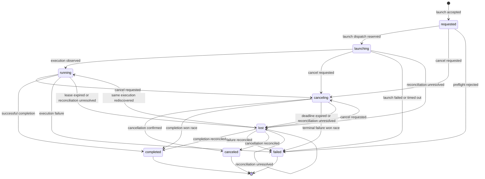

# Authoritative Session State Machine

Status: normative architecture specification

This document defines the durable lifecycle contract between the orchestrator and
Superset for one logical session. A session is identified by an immutable
`session_id`. Every accepted transition appends an event to the session history;
the current state is a projection of that history, never an independently mutable
field.

## Invariants

1. The orchestrator is the sole authority for lifecycle state. Superset reports
   observations and accepts commands, but does not directly transition a session.
2. Commands and observations carry `session_id`, `event_id`, `observed_version`,
   source, source timestamp, and correlation or causation ID. Event IDs are
   idempotency keys.
3. A transition uses compare-and-append against the current version. Exactly one
   writer advances a version; stale inputs are recorded but cannot mutate state.
4. Terminal states are monotonic. No event can transition a terminal session to
   a non-terminal state or to a different terminal state.
5. One `session_id` maps to at most one Superset execution identity. A disagreement
   never creates another execution.
6. Outputs are immutable artifacts. State events reference artifact IDs and
   completeness metadata rather than embedding mutable output.

## States

`requested`, `launching`, `running`, `canceling`, and `lost` are non-terminal.
`completed`, `failed`, and `canceled` are terminal. `lost` is deliberately
recoverable because it represents uncertainty, not proof that execution ended.

## Transition Table

Only the transitions below are legal. All other state-event pairs append a
`transition_rejected` audit event without changing the projected state.

| From | Accepted event | To | Stop reason | Required evidence |
| --- | --- | --- | --- | --- |
| none | `launch_accepted` | `requested` | none | Valid request and unused `session_id` |
| `requested` | `launch_reserved` | `launching` | none | Durable reservation for one Superset execution identity |
| `requested` | `cancel_requested` | `canceling` | none | Durable cancellation intent |
| `requested` | `preflight_rejected` | `failed` | `invalid_request`, `policy_denied`, or `dependency_unavailable` | Validation or policy result |
| `launching` | `execution_started` | `running` | none | Matching Superset execution identity |
| `launching` | `cancel_requested` | `canceling` | none | Durable cancellation intent |
| `launching` | `launch_failed` | `failed` | `launch_error` | Superset rejection or transport error after retry policy |
| `launching` | `launch_deadline_expired` | `failed` | `launch_timeout` | Deadline and final reconciliation query |
| `launching` | `reconciliation_unresolved` | `lost` | none | Bound execution identity cannot be reconciled |
| `running` | `cancel_requested` | `canceling` | none | Durable cancellation intent |
| `running` | `execution_completed` | `completed` | `succeeded` | Matching execution and final artifact manifest |
| `running` | `execution_failed` | `failed` | A failure reason below | Matching execution terminal observation |
| `running` | `observation_lease_expired` | `lost` | none | Lease deadline and unsuccessful reconciliation query |
| `running` | `reconciliation_unresolved` | `lost` | none | Bound execution identity cannot be reconciled |
| `canceling` | `cancellation_confirmed` | `canceled` | A cancellation reason below | Matching execution reports canceled or never started |
| `canceling` | `execution_completed` | `completed` | `succeeded_before_cancellation` | Completion timestamp or source sequence precedes effective cancellation |
| `canceling` | `execution_failed` | `failed` | A failure reason below | Failure timestamp or source sequence precedes effective cancellation |
| `canceling` | `cancellation_deadline_expired` | `lost` | none | Deadline and unsuccessful reconciliation query |
| `canceling` | `reconciliation_unresolved` | `lost` | none | Bound execution identity cannot be reconciled |
| `lost` | `execution_started` | `running` | none | The same reserved execution is rediscovered as active |
| `lost` | `cancel_requested` | `canceling` | none | Durable cancellation intent; no new execution is launched |
| `lost` | `execution_completed` | `completed` | `succeeded` or `succeeded_before_cancellation` | Matching terminal observation and artifacts |
| `lost` | `execution_failed` | `failed` | A failure reason below | Matching terminal observation |
| `lost` | `cancellation_confirmed` | `canceled` | A cancellation reason below | Matching terminal observation |
| `lost` | `reconciliation_unresolved` | `lost` | none | Bound execution identity remains unobservable |

## Ownership Rules

| State | Orchestrator obligation | Superset obligation |
| --- | --- | --- |
| `requested` | Validate, persist intent, and reserve exactly one execution identity | No execution exists yet |
| `launching` | Own dispatch retries, launch deadline, and identity binding | Deduplicate launch by bound identity and report acceptance or rejection |
| `running` | Renew observation lease, ingest progress, and persist artifact references | Execute work and emit sequenced observations for the bound identity |
| `canceling` | Preserve cancellation intent, issue idempotent stop commands, and reconcile races | Stop if possible and report the actual terminal outcome |
| `lost` | Reconcile the bound identity with backoff; never relaunch | Answer identity queries and report current or terminal execution state |
| terminal | Reject state mutation, retain history, and reconcile late evidence without regression | Retain terminal execution and artifact evidence according to policy |

Superset owns process execution and raw execution facts. The orchestrator owns the
interpretation of those facts into session state. Clients own neither.

## Stop Reasons

Every terminal transition stores exactly one stop reason.

| Terminal state | Allowed stop reasons |
| --- | --- |
| `completed` | `succeeded`, `succeeded_before_cancellation` |
| `failed` | `invalid_request`, `policy_denied`, `dependency_unavailable`, `launch_error`, `launch_timeout`, `execution_error`, `worker_crash`, `resource_exhausted`, `deadline_exceeded`, `artifact_error` |
| `canceled` | `user_requested`, `orchestrator_shutdown`, `superseded`, `policy_revoked` |

Free-form diagnostics may accompany a reason but cannot replace it. `lost` has no
stop reason because it is non-terminal.

## Partial Results

Every terminal event may reference an artifact manifest with `complete` set to
`true` or `false`. `completed` requires `complete: true`. `failed` and `canceled`
may retain verified artifacts with `complete: false`; their existence never changes
the terminal state. Each artifact includes producer identity, checksum, creation
time, and the last source sequence it incorporates. Artifacts received after a
terminal transition are quarantined until identity and checksum verification, then
recorded by an `artifact_reconciled` event without changing state or stop reason.

## Races And Late Events

### Cancellation race

The orchestrator first appends `cancel_requested`, then sends the stop command.
If
Superset provides a reliable source sequence, the earlier source-sequenced terminal
fact wins. Otherwise the first terminal event successfully appended by the
orchestrator wins. A losing observation is appended as `late_observation` and may
reconcile artifacts, but cannot alter the winning terminal state. Repeated cancel
requests are idempotent and preserve the first cancellation reason.

### Late completion

A completion for a terminal session is never promoted to `completed`. The
orchestrator appends `late_observation` with the existing terminal version,
validates any artifact manifest, and emits `artifact_reconciled` if new verified
artifacts are retained. Operators can audit the discrepancy without a silent state
regression.

### State disagreement

When Superset and the orchestrator disagree, the orchestrator appends
`reconciliation_required` containing both views and queries the already-bound
execution identity. It does not invoke launch. The query result appends one of:

- `reconciliation_confirmed`, when both views now agree;
- a legal lifecycle event from the transition table, when new evidence resolves
  non-terminal session; or
- `reconciliation_unresolved`, retaining or entering `lost` and scheduling another
  query.

An observation for a different execution identity appends
`foreign_execution_observed` and is never attached to the session automatically.

## Durable Implementation Mapping

`DurableStore.WorkerStatus` is the persisted projection of the states above. The
names differ because the store predates this specification; the mapping is exact
and there is no additional terminal state.

| Durable status | Specification state | Notes |
| --- | --- | --- |
| `requested` | `requested` | Accepted, not yet bound to an execution identity |
| `running` | `launching` or `running` | Requires a PID and process start token |
| `canceling` | `canceling` | Set before the provider stop command is issued |
| `succeeded` | `completed` | Stop reason `succeeded` or `succeeded_before_cancellation` |
| `failed` | `failed` | Includes deadline expiry via `deadline_exceeded` |
| `canceled` | `canceled` | Stop reason is one of the cancellation reasons |
| `unknown_outcome` | `lost` | Counted as settled by aggregate queries |

A deadline is not a distinct state. `LifecycleService.enforceDeadlines` expires an
overdue nonterminal session as `failed` with stop reason `deadline_exceeded`,
claiming the transition under the single-writer lock before contacting the
provider so concurrent sweeps expire each session exactly once. Cancellation
intent that a provider rejects as unsupported is withdrawn and the pre-cancel
status restored, so `canceling` always reflects a command the provider accepted or
one whose delivery is genuinely unknown.

If cancellation or deadline expiry wins while provider launch is in flight, the
terminal outcome remains monotonic. A later successful launch binds its exact run
identity and persists stop/reconciliation intent before the launch event commits;
restart reconciliation then stops the run when supported and records terminal or
missing-result evidence without changing the winning outcome. A later launch
failure clears pending delivery flags; it records `launch_error` only when no
terminal outcome had already won.

## Audit Projection

For deterministic replay, events are ordered by the orchestrator-assigned session
version, not wall-clock time. Each accepted or rejected input records the prior
version, decision, resulting version, actor, source event ID, and reason. A replay
from version zero must produce the same state, stop reason, execution binding, and
artifact manifest; divergence is an integrity failure and emits an operational
alert rather than rewriting history.
